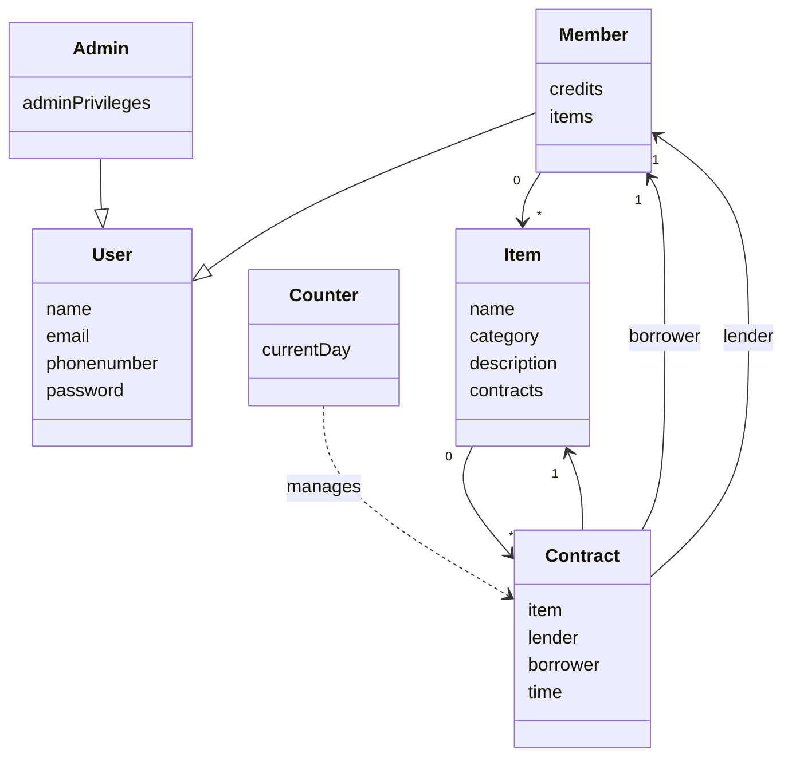

# Assignment 1

### Example: Domain Model for a Library System

```mermaid
classDiagram

    %% Classes

    class User {
        name
        email
        phonenumber
        password
    }

    class Admin {
        adminPrivileges
    }

    class Member {
        credits
        items
    }

    class Counter {
        currentDay
    }

    class Item {
        name
        category
        description
        contracts
    }

    class Contract {
        item
        lender
        borrower
        time
    }

    %% Relationships
    
    Member --|> User
    Admin --|> User
    Member "0" --> "*" Item
    Item "0" --> "*" Contract
    Contract --> "1" Member : borrower
    Contract --> "1" Member : lender
    Contract --> "1" Item
    Counter ..> Contract : manages

```
