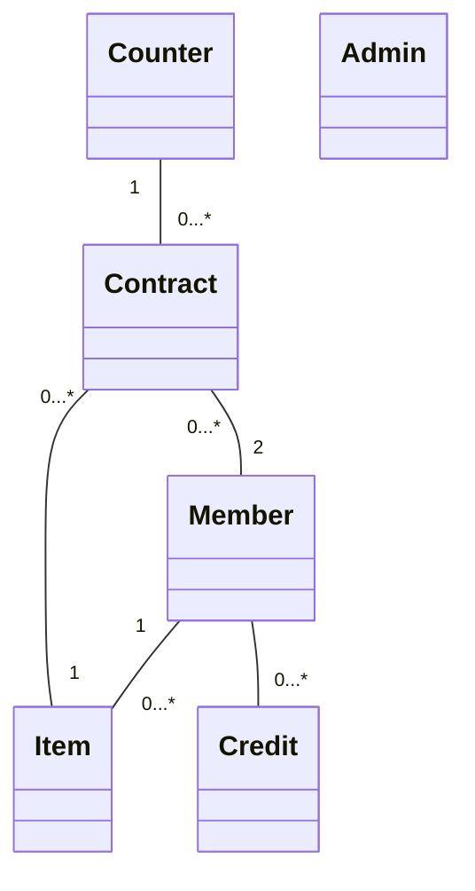

# Assignment 1

```mermaid
classDiagram

    %% Classes

    class Counter {
    
    }

    class Member {
    
    }

    class Item {

    }

    class Contract {

    }

    class Credit {

    }
    
    class Admin {

    }


    %% Relationships
    
    Member "1" -- "0...*" Item
    Item "1" -- "0...*" Contract
    Contract "0...*" -- "2" Member
    Member -- "0...*" Credit
    Counter "1" -- "0...*" Contract
```
